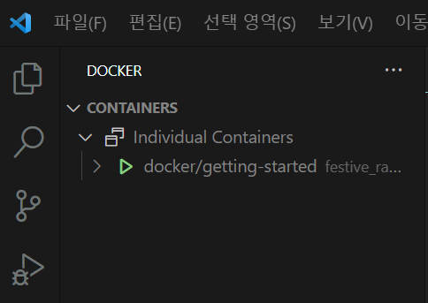

# 도입

해당 문서는 <a href="https://learn.microsoft.com/ko-kr/visualstudio/docker/tutorials/docker-tutorial" traget="_blank">MS의 Docker 자습서</a>를 살펴본 내용으로 구성되었습니다. 

실습은 VSCode가 권장됩니다. 

## 1. 컨테이너 만들기

### 기본 명령어 분석

```terminal
docker run -d -p 80:80 docker/getting-started
```

해당 명령어는 `docker run -dp 80:80 docker/getting-started` 방식으로 단일 문자 플래그를 활용하여 축약 가능.

`docker run`

- Docker에서 새 컨테이너를 시작하는 기본 명령어

`-d`

- 컨테이너를 detached 모드로 실행. 즉, 컨테이너가 백그라운드에서 실행되고 터미널에서는 즉시 컨트롤을 반환받음. 
  
`-p 80:80`

- 이 옵션은 포트 매핑을 설정. 
- `-p [호스트포트]:[컨테이너 포트]`
- 이 경우 호스트의 80번 포트를 컨테이너틔 80번 포트에 연결
- 이렇게 하면 호스트의 80번 포트로 들어오는 모든 트래픽이 컨테이너의 80번 포트로 전달됨.

`docker/getting-started`

- 실행할 컨테이너의 이미지
- 해당 이미지는 로컬 경로가 아닌 Docker의 로컬 저장소에서 검색
- 로컬 저장소에 해당 이미지가 존재하지 않는 경우에는 Docker Hub에서 다운받음
  - Docker Hub는 공식 Docker 이미지 레지스트리를 의미
  - <a href="https://hub.docker.com/" traget="_blank">Docker Hub</a>를 참고해보면 ubuntu, python, redis 같은 이미지들을 찾아볼 수 있음.
  


### 도커 컨테이너 실행하기

VSCode Docker Extension을 확인해보면 



위 이미지 처럼 CONTAINER이라는 부분에 개별 컨테이너로 등록된 것이 보인다. 

현재 실행한 커맨드를 통해 생성된 컨테이너의 이름은 지정하지 않았기에 자동으로 임의의 이름으로 지정되었다. 

실행된 컨테이너를 통해 웹페이지를 실행시키는 방법은 다음과 같다

1. 해당 컨테이너를 오른쪽 클릭해보면 나타나는 Open in Browser를 선택
2. 브라우저에서 http://localhost/tutorial/ 를 입력

그러면 로컬로 호스팅되는 DockerLabs에 대한 페이지가 표시된다.


### 도커 컨테이너 삭제하기

1. 위 사진에서 Open in Browser를 선택할때처럼 Remove를 선택하여 직접 삭제
2. `docker ps`  명령어를 통해 현재 실행되고 있는 도커의 상태를 확인하고 `docker stop <container-id>` or `docker rm <container-id>` 명령어를 통해 삭제한다. 

공식 문서에서는 `rm`과 `stop`으로 설명을 하고 있지만 둘은 느낌이 엄연히 다르다. 그리고 `stop`을 설명하려면 `kill`도 같이 설명을 해야한다고 생각한다. 


`docker kill`

컨테이너를 정상적으로 정지시킨다. 이 명령어는 컨테이너 내의 메인 프로세스에 SIGTERM(종료) 시그널을 보내어 컨테이너를 안전하게 정지시키도록 요청한다. 만약 컨테이너가 지정된 시간 내에 정상적으로 종료되지 않으면, Docker는 SIGKILL 시그널을 보내어 강제로 종료시킨다. 이 방법은 컨테이너를 종료하기 전에 정리 작업을 수행할 수 있게 해준다.

`docker kill`

컨테이너를 강제로 종료한다. docker kill은 컨테이너에 바로 SIGKILL 시그널을 보내어 즉시 종료시킨다. 이 방법은 정상적인 종료 절차를 밟지 않기 때문에, 진행 중인 작업이나 상태를 저장하지 못할 수 있다.

`docker rm`

컨테이너를 삭제한다. 이 명령어는 이미 정지된 컨테이너를 시스템에서 완전히 제거한다. 실행 중인 컨테이너를 삭제하려면 먼저 docker stop 또는 docker kill을 사용하여 컨테이너를 정지시켜야 한다. docker rm 명령은 컨테이너와 관련된 모든 리소스를 제거하므로, 이 컨테이너는 복구할 수 없다.

컨테이너 창을 보면 알 수 있겠지만, stop과 kill로 종료한 컨테이너의 경우 삭제되지 않고 남아있다. 

그 상태에서 다시 rm 명령어를 사용하면 컨테이너가 삭제된 것을 볼 수 있다. 

이전에 실행시킨 컨테이너의 이름을 까먹었다면 `docker ps -a`을 통해 현재 실행중이지 않은 컨테이너의 상태들을 조회해보자. 


---

## 2. 앱의 컨테이너 이미지 빌드 

실습 레포를 가져와 이미지를 실행시켜보는 단계..

1. <a href="https://github.com/docker/getting-started" target="_blank">도커 자습서</a>에서 레포 클론 `https://github.com/docker/getting-started.git`

2. app 폴더로 이동하여 Dockerfile 생성
```dockerfile
FROM node:20-alpine
RUN apk add --no-cache python3 g++ make
WORKDIR /app
COPY . .
RUN yarn install --production
CMD ["node", "/app/src/index.js"]
```

`FROM node:20-alpine`

이 명령은 Docker 이미지의 기본 레이어로 사용될 베이스 이미지를 지정한다. 여기서는 node:20-alpine이 사용된다. 이는 Node.js 버전 20을 포함하는 경량화된 Alpine Linux 기반 이미지이다.

`RUN apk add --no-cache python3 g++ make`

RUN 명령은 이미지 빌드 과정 중에 실행될 명령어를 지정한다. 여기서는 Alpine 패키지 매니저인 apk를 사용하여 Python3, g++, 그리고 make를 설치한다. --no-cache 옵션은 불필요한 캐시 파일을 저장하지 않도록 하여 이미지 크기를 줄이는 역할을 한다.

`WORKDIR /app`

이 명령은 이미지 내의 작업 디렉토리를 /app으로 설정한다. 이후의 명령어들은 이 디렉토리 내에서 실행된다.

`COPY . .`

현재 디렉토리(이 Dockerfile이 위치한 곳)의 모든 파일을 이미지의 현재 작업 디렉토리(/app)로 복사한다.

`RUN yarn install --production` 

yarn install 명령을 실행. --production 플래그는 개발 의존성을 제외하고 설치를 진행함을 의미한다.

`CMD ["node", "/app/src/index.js"]`

CMD 명령은 컨테이너가 시작될 때 실행될 기본 명령을 지정한다. 여기서는 Node.js를 사용하여 /app/src/index.js를 실행한다는 의미. 이 명령은 컨테이너가 시작될 때마다 실행.


3. 도커 빌드

```terminal
docker build -t getting-started .
```

`-t`
빌드될 이미지의 이름을 지정하겠다는 의미. 여기서는 이미지의 이름으로 getting-started를 사용.

` .`
Dockerfile의 경로 표시

즉, 도커로 빌드해서 getting-started라는 이미지를 현재 폴더에 있는 Dockerfile을 이용해서 생성하겠다는 의미.

---


## Docker build와 Docker run의 차이점

`docker build`

- 의미: **Docker 이미지를 생성**

- 사용되는 곳: Dockerfile이 있는 디렉토리에서 사용된다. Dockerfile은 애플리케이션과 실행 환경을 구성하는 단계별 지시사항을 포함한다.

- 기능: Dockerfile의 지시사항에 따라 새로운 Docker 이미지를 빌드한다. 이 이미지는 애플리케이션을 실행하는 데 필요한 모든 코드, 런타임, 라이브러리, 환경 변수 등을 포함한다.

- 결과: 실행 가능한 이미지가 생성되며, 이를 통해 컨테이너를 실행할 수 있다.

- 예시 명령어: `docker build -t my-app .`


`docker run`

- 의미: **Docker 이미지로부터 컨테이너를 생성하고 실행**

- 사용되는 곳: 이미 빌드된 Docker 이미지를 기반으로 사용된다.

- 기능: 지정된 이미지를 기반으로 새로운 컨테이너를 만들고 시작한다. 컨테이너는 이미지의 인스턴스로, 독립된 환경에서 애플리케이션을 실행한다.

- 결과: 이미지의 애플리케이션을 포함하는 실행 중인 컨테이너가 생성한다.

- 예시 명령어: `docker run -d -p 80:80 my-app`


---

## 내용 정리...

`docker build`는 이미지를 생성하는 명령어. 

`docker run`은 생성된 이미지를 실행하여 컨테이너를 생성하고 시작하는 명령어.

build를 하기 위해서는 Dockerfile이 필요. 해당 파일의 지시사항에 따라 새로운 Docker 이미지를 빌드. 

실행된 컨테이너의 상태는 `docker ps` 명령어를 통해 헬스 체크가 가능

`docker stop [컨테이너 ID 혹은 이름]` 혹은 `docker kill [컨테이너 ID 혹은 이름]`를 통해 실행중인 컨테이너를 종료 가능.

종료 여부는 `docker ps -a` 명령어를 통해 확인 가능. -a는 모든걸 보여준다는 의미로 모든 컨테이너를 보여주는 옵션

`docker rm [컨테이너 ID 혹은 이름]` 를 통해 컨테이너를 삭제 가능

추가로 도커 이미지들을 확인하기 위해서는 `docker image ls` 혹은 `docker images` 명령어를 실행.

도커 이미지를 삭제하기 위해서는 `docker rmi [이미지 ID 혹은 이름]` 을 실행


## 순서대로 실행해보면 

1. Dockerfile 작성
2. `docker images` => 이미지 없음
3. `docker build -t getting-started .`
4. `docker images` => getting-started 이미지 생성됨
5. `docker ps`, `docker ps -a` => 컨테이너 없음
6. `docker run -d -p 3000:3000 getting-started` => getting-started 라는 이름의 이미지를 실행시켜 컨테이너 실행
7. `docker ps`, `docker ps -a` => 둘다 컨테이너 존재
8. `docker stop [컨테이너 ID 혹은 NAMES]` => [컨테이너 ID 혹은 NAMES] 컨테이너 종료
9. `docker ps` => 컨테이너 없음
10. `docker ps -a` => 컨테이너 존재
11. `docker rm getting-started` => 컨테이너 삭제
12. `docker images` => 이미지 존재
13. `docker rmi getting-started` => 이미지 삭제